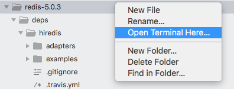
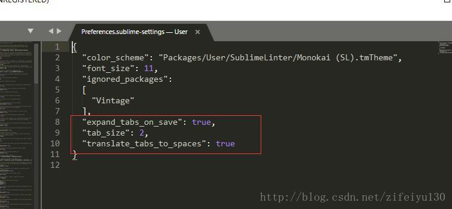

## ubuntu设置sublime text3为默认文本编辑器
第一步： 
在sublime_text3的安装目录下打开命令窗，默认安装目录是：/opt/sublime_text

第二步： 
执行以下命令 ：

sudo subl /etc/gnome/defaults.list

第三步： 
ctrl+h， 把所有gedit.desktop替换为sublime_text.desktop ，然后保存就可以啦

## 在linux下的终端中使用sublime3打开文件

	通过ln命令创建软连接实现

	echo $PATH 查看路径

	例 我的路径是：

	/home/rh/anaconda3/bin:/home/rh/bin:/home/rh/.local/bin:/usr/local/sbin:/usr/local/bin:/usr/sbin:/usr/bin:/sbin:/bin:/usr/games:/usr/local/games:/snap/bin

	 

	sudo ln -s /Applications/Sublime\ Text.app/Contents/SharedSupport/bin/subl /home/rh/anaconda3/bin/subl

	修改红字为上方路径中对应的红字

	subl为打开sublime3的命令

## 侧边栏显示在终端打开

原文链接：https://blog.csdn.net/u010285974/java/article/details/86218294

1.安装terminal包

这就不多说了：

    ctrl + shift + p 搜索package install
    弹出package搜索框，在搜索terminal，点击安装即可。

2.配置终端路径
xterm on GNU/Linux

    {
      "terminal": "xterm"
    }

## Git学习第（三）篇：Sublime Text3 Git插件安装与使用
本文链接：https://blog.csdn.net/m0_37617778/article/details/83111550

## sublime的TAB和空格统一

选择Preference->Settings

把红框里的东东添加进设置里
