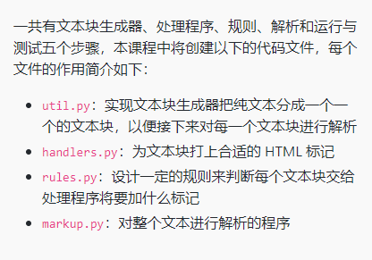

# Markdown基本语法
## 标题
```
# 一级标题
## 二级标题
### 三级标题
```
## 字体
```
*斜体*
**加粗**
***斜体加粗***
~~删除线文字~~
```
效果：
*斜体*
**加粗**
***斜体加粗***
~~删除线文字~~

## 引用
在引用的文字前加`>`
```
> 这是引用的内容1
>> 这是引用的内容2
>>> 这是引用的内容3，嵌套
```

## 分割线
三个或三个以上的 `-`或着 `*` 都可以
```
---
----
***
****
```
效果：
---
文本1
----
文本2
***
文本3
****
文本4

## 图片
```

图片alt就是显示在图片下面的文字
图片title，当鼠标移到图片上是显示的内容
示例：


方法2
 <div align="center"> </div>   <div align="center">前有空格
```


 <div align="center"> </div>

## 超链接
```
[超链接名](超链接地址 "超链接title")
title可加可不加

示例：
[百度](http://baidu.com)

```
[百度](http://baidu.com)

## 列表

无序

```
- 项目符号
* 项目符号
+ 项目符号
```
- 项目符号
* 项目符号
+ 项目符号

有序
```
1. 列表1
2. 列表2
```
1. 列表1
2. 列表2


列表嵌套

上一级和下一级之间敲三个空格即可

1. 第一季
   1. 子集1
   2. 集子2
   - 试试看

## 表格
```
表头|表头|表头
---|:--:|---:
内容|内容|内容
内容|内容|内容

第二行分割表头和内容。
- 有一个就行，为了对齐，多加了几个
文字默认居左
-两边加：表示文字居中
-右边加：表示文字居右
注：原生的语法两边都要用 | 包起来。此处省略

示例：
姓名|技能|排行
--|:--:|--:
刘备|哭|大哥
关羽|打|二哥
张飞|骂|三弟
```

姓名|技能|排行
--|:--:|--:
刘备|哭|大哥
关羽|打|二哥
张飞|骂|三弟

## 代码

`代码内容`

## 脚注
somw text with a footnote.[^1]


[^1]: The footnot

## 缩写
Mark逗我呢convertstext HTML
*[HTML]: HyperText Markup Language