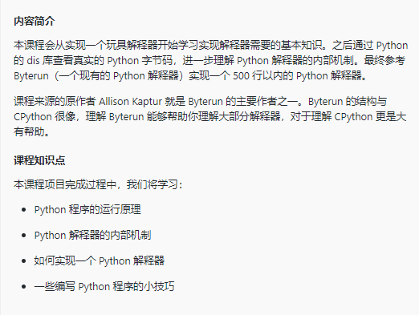

## 解释器


入门解释器最基本的三个指令:

 1. LODA_VALUE
 2. ADD_TWO_VALUES
 3. PRINT_ANSWER

以7+5为例
```python3
	what_to_execute = {
		"instructions": [("LOAD_VALUE", 0),
						("LOAD_VALUE", 1), 
						("ADD_TWO_VALUES", None),
						("PRINT_ANSWER", None)],		
		"numbers": [7, 5]
	}
```
在这里 `what_to_execute` 相当于 code object ，`instructions` 相当于字节码
我们的解释器是一个堆栈机器，所以是使用栈来完成加法的。首先执行第一个指令 `LOAD_VALUE` ，将第一个数压入栈中，第二个指令同样将第二个数压入栈中。第三个指令 `ADD_TWO_VALUES` 弹出栈中的两个数，将它们相加并将结果压入栈中，最后一个指令弹出栈中的答案并打印。


`LOAD_VALUE` 指令需要找到参数指定的数据进行压栈，那么数据哪里来的呢？可以发现我们的指令集包含两部分：指令自身和一个常量列表。数据来自常量列表。

了解这些后，开始写我们的解释器程序。我们使用列表来表示栈，同时编写指令相应的方法模拟指令的运行效果。

新建文件 inter1.py 文件，将以下代码写入文件：

```python
# /urs/bin/python3
# -*-coding:utf-8-*-

class Interperter:
	def __init__(self):
		self.stack = []
	def LOAD_VALUE(self, number):
		self.stack.append(number)
	def ADD_TWO_VALUES(self):
		first_num = self.stack.pop()
		second_num = self.stack.pop()
		total = first_num + second_num
		self.stack.append(total)
	def PRINT_ANSWER(self):
		answer = self.stack.pop()
		print(answer)
	def run_code(self, what_to_execute):
		instructions = what_to_execute['instructions']
		numbers = what_to_execute['numbers']
		for step in instructions:
			instruction, argument = step
			if instruction == 'LOAD_VALUE':
				value = numbers[argument]
				self.LOAD_VALUE(value)
			if instruction == 'ADD_TWO_VALUES':
				self.ADD_TWO_VALUES()
			if instruction == 'PRINT_ANSWER':
				self.PRINT_ANSWER()

if __name__ == '__main__':
	interpreter = Interperter()
	what_to_execute = {
		"instructions": [("LOAD_VALUE", 0),
						("LOAD_VALUE", 1), 
						("ADD_TWO_VALUES", None),
						("PRINT_ANSWER", None)],		
		"numbers": [7, 5]
	}
	interpreter.run_code(what_to_execute)
```

尽管我们的解释器现在还很弱，但它执行指令的过程跟真实 Python 实际上是差不多的，代码里有几个需要注意的地方：

- 代码中 LOAD_VALUE 方法的参数是已读取的常量而不是指令的参数。
- ADD_TWO_VALUES 并不需要任何参数，计算使用的数直接从栈中弹出获得，这也是基于栈的解释器的特性。


下一步我们要在我们的解释器中加入变量这个概念，因此需要新增两个指令：

- STORE_NAME: 存储变量值，将栈顶的内容存入变量中。
- LOAD_NAME: 读取变量值，将变量的内容压栈。

以及新增一个变量名列表。

下面是我们需要运行的指令集合：
```python
# 源代码
def sum_():
    a = 1
    b = 2
    print(a + b)

# 编译后的字节码
what_to_execute = {
    "instructions": [("LOAD_VALUE", 0),
                     ("STORE_NAME", 0),
                     ("LOAD_VALUE", 1),
                     ("STORE_NAME", 1),
                     ("LOAD_NAME", 0),
                     ("LOAD_NAME", 1),
                     ("ADD_TWO_VALUES", None),
                     ("PRINT_ANSWER", None)],
    "numbers": [1, 2],
    "names":   ["a", "b"] }
```

```python
class Interpreter:
    '''解释器类，类的实例为解释器
    '''

    def __init__(self):
        '''初始化一个空列表作为栈
        '''
        self.stack = []         # 栈
        self.environment = {}   # 存储变量映射关系的字典

    def STORE_NAME(self, name):
        '''将变量及其值存入字典
        '''
        value = self.stack.pop()
        self.environment[name] = value

    def LOAD_NAME(self, name):
        '''将变量的值压入栈中
        '''
        value = self.environment[name]
        self.stack.append(value)

    def LOAD_VALUE(self, number):
        '''将一个数值压入栈中
        '''
        self.stack.append(number)

    def ADD_TWO_VALUES(self):
        '''弹出栈中的两个数值，求和后将结果压入栈中
        '''
        first_num = self.stack.pop()
        second_num = self.stack.pop()
        total = first_num + second_num
        self.stack.append(total)

    def PRINT_ANSWER(self):
        '''将栈中的数值弹出，返回
        '''
        answer = self.stack.pop()
        print(answer)

    def parse_argument(self, instruction, argument, what_to_execute):
        '''解析指令参数
        '''
        # 使用常量的指令列表
        numbers = ['LOAD_VALUE']
        # 使用变量名的指令列表
        names = ['LOAD_NAME', 'STORE_NAME']
        if instruction in numbers:
            argument = what_to_execute['numbers'][argument]
        if instruction in names:
            argument = what_to_execute['names'][argument]
        return argument

    def run_code(self, what_to_execute):
        '''执行字节码指令
        '''
        # 指令列表
        instructions = what_to_execute['instructions']
        # 常数列表
        numbers = what_to_execute['numbers']
        # 遍历指令列表，依次执行
        for step in instructions:
            instruction, argument = step
            argument = self.parse_argument(instruction, argument,
                    what_to_execute)
            if instruction == 'LOAD_VALUE':
                self.LOAD_VALUE(argument)
            if instruction == 'ADD_TWO_VALUES':
                self.ADD_TWO_VALUES()
            if instruction == 'PRINT_ANSWER':
                self.PRINT_ANSWER()
            if instruction == 'STORE_NAME':
                self.STORE_NAME(argument)
            if instruction == 'LOAD_NAME':
                self.LOAD_NAME(argument)
                
    # run_code 进化版 execute
    def execute(self, what_to_execute):
	    instructions = what_to_execute["instructions"]
	    for each_step in instructions:
	        instruction, argument = each_step
	        argument = self.parse_argument(instruction, argument, what_to_execute)
	        bytecode_method = getattr(self, instruction)
	        if argument is None:
	            bytecode_method()
	        else:
	            bytecode_method(argument)
```
